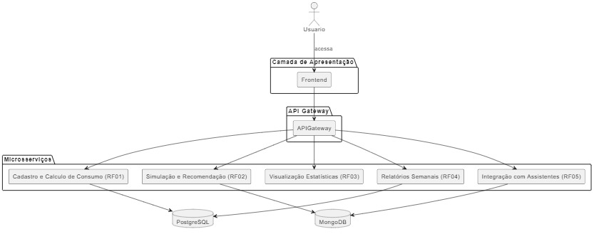

# as_es_20251_g3

Repositório criado para a manutenção de artefatos de trabalho gerados pelo Grupo 3, durante a disciplina de Arquitetura de Software, do curso de Engenharia de Software, da Universidade Federal de Goiás.

## Nome do Projeto

**Sistema de Gestão de Energia Elétrica Inteligente**

## Descrição

Sistema para monitoramento, análise, recomendação e controle do consumo de energia elétrica com suporte a dispositivos inteligentes e assistentes pessoais.

## Problema

Usuários residenciais e empresariais enfrentam dificuldade para compreender seu consumo elétrico e tomar decisões que levem à economia de energia.

## Objetivos da Solução

- Calcular e visualizar o consumo de energia por aparelho.
- Simular cenários de economia com base nos hábitos do usuário.
- Visualizar estatísticas de consumo via interface gráfica multiplataforma.
- Gerar relatórios com comparação semanal de consumo.
- Integrar com assistentes pessoais para controle de dispositivos.

## Grupo

Arthur Felipe Nascimento, Janderson Oliveira, Luis Felipe Ferreira, Phablo Tavares, Thiago Vicente  
**Grupo: 3**

---

## Backlog do Produto

### Requisitos Funcionais

| Id   | Descrição                                                                 |
|------|---------------------------------------------------------------------------|
| RF01 | [HU-001] Calcular o consumo de energia de cada aparelho com base na potência e tempo de uso. |
| RF02 | [HU-002] Simular diferentes cenários de economia com base nos hábitos do usuário. |
| RF03 | [HU-003] Fornecer uma interface gráfica multiplataforma para visualização de estatísticas e consumo. |
| RF04 | [HU-004] Gerar relatórios diários com comparação semanal de consumo.     |
| RF05 | [HU-005] Integrar-se com assistentes pessoais para controle de dispositivos inteligentes. |

### Requisitos Não Funcionais

| Id    | Descrição                                                                 |
|-------|---------------------------------------------------------------------------|
| RNF01 | Interface compatível com Windows, macOS e Linux.                         |
| RNF02 | Atualização dos dados em tempo real ou em intervalos regulares.         |
| RNF03 | Interface deve seguir boas práticas de acessibilidade.                  |
| RNF04 | Resposta a comandos em até 2 segundos.                                  |
| RNF05 | Disponibilidade mínima de 99% ao mês.                                   |
| RNF06 | Integração com APIs de assistentes pessoais deve ser segura.            |
| RNF07 | Suporte a eventos via protocolo MQTT para IoT.                          |

---

## Regras de Negócio

| Id   | Descrição                                                                 |
|------|---------------------------------------------------------------------------|
| RN01 | Cálculo de consumo com base na fórmula (W × h)/1000.                     |
| RN02 | Simulações devem considerar hábitos de uso e perfis diários.            |
| RN03 | O sistema deve sugerir reduções com maior impacto financeiro.           |
| RN04 | A interface deve apresentar informações compreensíveis a usuários leigos. |
| RN05 | Comandos por voz devem refletir no painel de consumo.                   |
| RN06 | Histórico de comandos por voz deve ser armazenado.                      |

---

## Matriz de Rastreabilidade de Requisitos

### Requisitos Funcionais × Requisitos Não Funcionais

| Requisito Funcional | Requisito Não Funcional              |
|---------------------|--------------------------------------|
| RF01                | RNF02, RNF04                         |
| RF02                | RNF02, RNF05                         |
| RF03                | RNF01, RNF02, RNF03                  |
| RF04                | RNF02                                |
| RF05                | RNF06, RNF07                         |

### Requisitos Funcionais × Regras de Negócio

| Requisito Funcional | Regra de Negócio                     |
|---------------------|--------------------------------------|
| RF01                | RN01                                |
| RF02                | RN02, RN03                          |
| RF03                | RN04                                |
| RF04                | RN04                                |
| RF05                | RN05, RN06                          |

### Regras de Negócio × Requisitos Não Funcionais

| Regra de Negócio | Requisito Não Funcional |
|------------------|--------------------------|
| RN01             | RNF02                   |
| RN02             | RNF02                   |
| RN03             | RNF02                   |
| RN04             | RNF01, RNF03            |
| RN05             | RNF06                   |
| RN06             | RNF06                   |

### Regras de Negócio × História de Usuário

| Requisito | Fonte     |
|-----------|-----------|
| RN01      | HU-001    |
| RN02      | HU-002    |
| RN03      | HU-002    |
| RN04      | HU-003, HU-004 |
| RN05      | HU-005    |
| RN06      | HU-005    |

---

## Modelo Arquitetural

O sistema adotará arquitetura de microsserviços com os seguintes módulos principais:

- Cadastro e Cálculo de Consumo (RF01)
- Simulação e Recomendações (RF02)
- Interface Gráfica Multiplataforma (RF03)
- Geração de Relatórios e Análise (RF04)
- Integração com Assistentes Pessoais (RF05)

---

## Modelo de Interfaces Gráficas

- Tela de cadastro de aparelhos e visualização de consumo individual
- Tela de simulação de economia
- Dashboard com gráficos de consumo
- Tela de relatórios diários e comparação semanal
- Tela de configurações de assistente pessoal

---

## Tecnologia de Persistência de Dados

- PostgreSQL para dados estruturados
- MongoDB para histórico de consumo e logs

---

## Local do Deploy

- Backend: AWS ou Azure
- Frontend: Vercel, Netlify
- Banco de dados: AWS RDS + MongoDB Atlas
